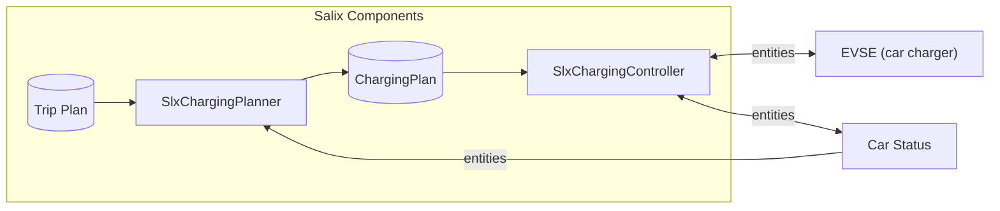

# Salix Project 
Goal of Salix Project is to create a set of tools optimizing energy use at home.  
Our mission is to help consumers rely on greener and cheaper energy.

## EV Charging assistance 
Our current focus is on creating tools which help users efficiently manage EV (Electric Vehicle) charging.   
### Problem statement:
EV batteries have considerable capacity. Only a fraction of its capacity is used on a day to day basis. 
Charge time can be optimized to get best use of green and cheap energy.  
Additionally many consumers also produce energy( e.g. with solar panels) and optimum charging should consider this.

Users are not very good at estimation the battery SOC they really need. This combined with range anxiety results in keeping a high state of charge(SOC) and charging in non-optimum time slots.   

Existing home charges are able to perform some optimizations:
* charging in off-peak hours
* diverting extra solar energy to charge a car.  

But they do not provide a comprehensive solution and still rely heavily on user's input to e.g. change from "PV divert" into "charge from grid" in cases when a user needs higher SOC which solar can not guarantee.

Building an optimum charging plan includes multiple number of factors:
* How many kilometers of range do I need in the next few days?
* What is an average consumption?
* When will the cheapest energy be in the next few days? 
* How much energy does my car consume per km?
* I have solar panels - what’s the weather tomorrow? Should I charge the car at night using cheap grid energy or wait for tomorrow to use my own solar production?

### Solution
Build a system which plans optimum charging sessions to ensure that there is enough energy in the car’s battery for expected usage. 
System will use following sets of information:
* Planned trips (to know how much range user needs)
* Defined battery buffers (to know how much range the user wants to be left after a planned trip).

System will also manage charging process combining information from charger(EVSE) and car (current SOC) to ensure that proper SOC is achieved.

### Why Home Assistant?
[Home Assistant](https://www.home-assistant.io/) is chosen as a foundation for Salix development.  
Home assistant gives great leverage for further development:  
* Thousands of integrations with devices and services (including vehicles connectivity) from multiple manufacturers. 
* Excellent foundation to add new functionalities and connect them together with other types of devices. 
* Huge community.

## Design

### UX
Exemplary Home Assistant dashboard with active charging session:

### Architecture

Salix Integrations:
* [**Salix Charging Controller**](https://github.com/artursulkowski/slxchargingcontroller)
* **SalixChargingPlanner** Defines charging plan based on trip plan. 

Non-Salix integrations:
* **Car Status** - Provides information about EV's SOC - e.g. [Hyundai-Kia-Connect](https://github.com/Hyundai-Kia-Connect/kia_uvo)
* **EVSE** - Integration for car's charger. Provides information about current charging session. 

